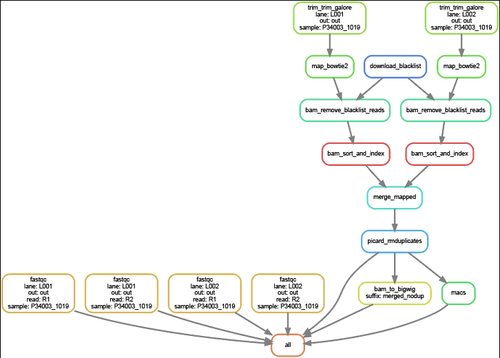

# bulk CUT&Tag data analysis pipeline 
Standard pipeline to map CUT&amp;Tag data and generate genome browser tracks

Marek Bartosovic 

# Pipeline overwiew

Pipeline is written in workflow manager snakemake



The pipeline assumes the standard Illumina naming convention of the fastq files:
```P27054_1001_S1_L001_R1_001.fastq.gz```

For more information in Illumina naming convention visit:
https://support.illumina.com/help/BaseSpace_OLH_009008/Content/Source/Informatics/BS/NamingConvention_FASTQ-files-swBS.htm

## Step 1 - clone the pipeline 

cd into directory with the project and clone the repo

```
cd /PATH/TO/MY_PROJECT
git clone https://github.com/bartosovic-lab/bulk_CT_pipeline
```

## Step 2 - install conda and prepare the base environment

Download miniconda from:
https://www.anaconda.com/docs/getting-started/miniconda/install

```
wget https://repo.anaconda.com/miniconda/Miniconda3-latest-Linux-x86_64.sh
sh Miniconda3-latest-Linux-x86_64.sh
```

logout and login or run ```source ~/.bashrc``` to initialise conda

#### Create base environment for the pipeline specified in the bulk_CT_pipeline repo

```
# Create the environment
conda env create -f bulk_CT_pipeline/envs/bulkCT_base.yaml

# Activate it
conda activate bulkCT_base

# Add conda-forge to the channels
conda config --append channels conda-forge

```


## Step 3 - generate config file 

Create config file in yaml format.

Minimal config file should look like this:
```
general:
  lanes:
    - L001
    - L002
  reads:
    - R1
    - R2
  bowtie2_index: /data/references/bowtie/hg38/GRCh38_noalt_as
  genome: hg38       # Accepted options are hg38, hg19 or mm10
  output_dir: out 
samples:
  P27054_1001:
    L001:
      R1:   /crex/proj/snic2022-23-547/private/marek/Thermo_Abs/P27054/P27054_1001/02-FASTQ/220817_A00621_0730_AH7F2GDRX2/P27054_1001_S1_L001_R1_001.fastq.gz   # Your path to L001 R1 file
      R2:   /crex/proj/snic2022-23-547/private/marek/Thermo_Abs/P27054/P27054_1001/02-FASTQ/220817_A00621_0730_AH7F2GDRX2/P27054_1001_S1_L001_R2_001.fastq.gz   # Your path to L001 R2 file
    L002:
      R1:   /crex/proj/snic2022-23-547/private/marek/Thermo_Abs/P27054/P27054_1001/02-FASTQ/220817_A00621_0730_AH7F2GDRX2/P27054_1001_S1_L002_R1_001.fastq.gz   # Your path to L002 R1 file
      R2:   /crex/proj/snic2022-23-547/private/marek/Thermo_Abs/P27054/P27054_1001/02-FASTQ/220817_A00621_0730_AH7F2GDRX2/P27054_1001_S1_L002_R2_001.fastq.gz   # Your path to L002 R2 file
```

You can use pipeline script to generate config:

```python3 bulk_CT_pipeline/scripts/generate_config.py /PATH/TO/FOLDER_WITH_FASTQ_FILES > config.yaml```

The script will search for all ```*.fastq.gz ``` files in the nested folder and from _LXXX_ and _RXXX_ determine L001/L002 files and  R1/R2 files 

#### Important:  After generating the config check that all needed files are present in the file
#### Important: Change the path to the bowtie2 index within the pipeline config file

You can always edit the paths or any mistakes in the config file manualy or write your own script to generate config file

#### Note: 

Sometimes the script picks up 3 fastq files (R1,R2,R3) if the bulk run was sequenced together with another single-cell library.

In that case, typically 
 - R1 file = R1
 - R2 file = I1
 - R3 file = R2

Rename your reads accordingly


## Step 4 - setup slurm profile for batch job submission (Optional - if using slurm scheduler)

### This only needs to be done once for server, and the same profile can be reused by other snakemake pipelines

If running on rackham, create slurm profile for snakemake so the jobs can be submitted into the slurm queue by snakemake

For instructions how to do this follow:
https://github.com/Snakemake-Profiles/slurm

Here is how the setup looks for Rackham
```
profile_dir="${HOME}/.config/snakemake"
template="gh:Snakemake-Profiles/slurm"

mkdir -p "$profile_dir"

# Run:
cookiecutter --output-dir "$profile_dir" "$template"

# Here you get prompted several times

You've downloaded /home/marek/.cookiecutters/slurm before. Is it okay to delete and re-download it? [yes]: yes

profile_name [slurm]: slurm

Select use_singularity:
1 - False
2 - True
Choose from 1, 2 [1]: 1

Select use_conda:
1 - False
2 - True
Choose from 1, 2 [1]: 2

jobs [500]:    
<enter>

restart_times [0]: 0
<enter>

max_status_checks_per_second [10]: 
<enter>

max_jobs_per_second [10]: 
<enter>

latency_wait [5]: 
<enter>

Select print_shell_commands:
1 - False
2 - True
Choose from 1, 2 [1]: 2

# In this one it's imporant to insert the correct account name
sbatch_defaults []: account=<naiss2023-22-***> time=0-24:00 partition=shared output=logs/slurm_%j.out error=logs/slurm_%j.err

cluster_sidecar_help [Use cluster sidecar. NB! Requires snakemake >= 7.0! Enter to continue...]: 
Select cluster_sidecar:
1 - yes
2 - no
Choose from 1, 2 [1]: 2
cluster_name []:        
cluster_jobname [%r_%w]: 
cluster_logpath [logs/slurm/%r/%j]: 
cluster_config_help [The use of cluster-config is discouraged. Rather, set snakemake CLI options in the profile configuration file (see snakemake documentation on best practices). Enter to continue...]: 
cluster_config []:
```
A folder with the config should appear at 
```$HOME/.config/snakemake/```

## Step 4 - Run the pipeline 
The pipeline is optimized to run on Rackham cluster

It is recommended to run the pipeline inside tmux session, for detailed instructions on tmux follow:
https://github.com/tmux/tmux/wiki/Getting-Started


Run the pipeline :

```snakemake --snakefile bulk_CT_pipeline/workflow/Snakefile.smk --cores 20 --jobs 100 -p --configfile config.yaml --rerun-incomplete --use-conda --profile slurm --conda-frontend conda ```

Note: pipeline was built and tested on snakemake version 7.32.4, check that you snakemake version matches.

Snakemake is frequently updated and command line arguments may differ between versions